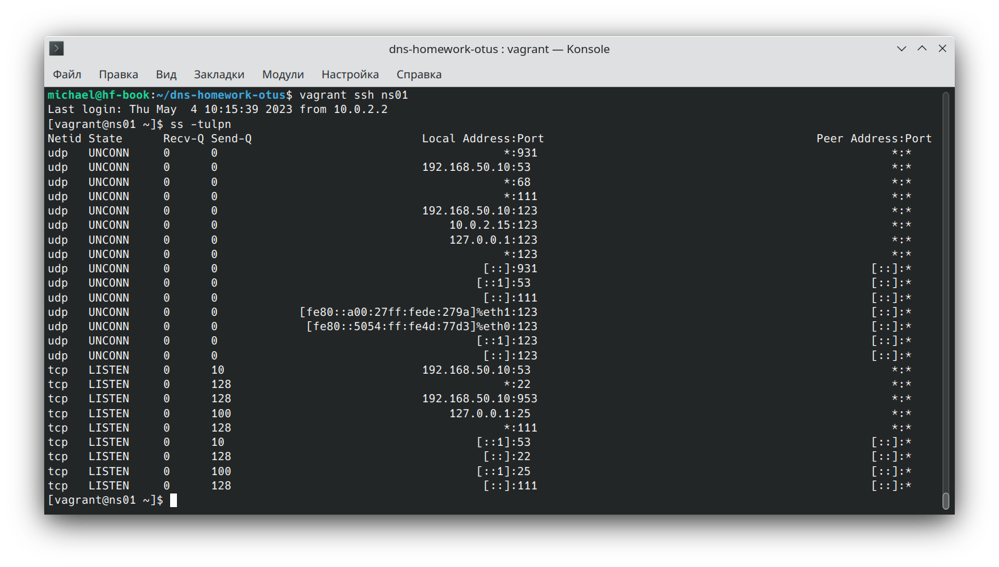

# dns-homework-otus
<h3>1. Работа со стендом и настройка DNS</h3>
добавить еще один сервер client2

добавил в Vagrantfile:
```bash
  config.vm.define "client2" do |client2|
    client2.vm.box_check_update = false
    client2.vm.network "private_network", ip: "192.168.50.16", virtualbox__intnet: "dns"
    client2.vm.hostname = "client2"
  end
```

в playbook.yml добавил в hosts к клиенту1 клиента2
```bash
- hosts: client, client2
  become: yes
  tasks:
  - name: copy resolv.conf to the client
    copy: src=client-resolv.conf dest=/etc/resolv.conf owner=root group=root mode=0644
  - name: copy rndc conf file
    copy: src=rndc.conf dest=/home/vagrant/rndc.conf owner=vagrant group=vagrant mode=0644
  - name: copy motd to the client
    copy: src=client-motd dest=/etc/motd owner=root group=root mode=0644
```

добавил сервис ntp в таску на установку пакетов на all hosts
дописал следующие правила на вкл ntpd + выкл chronyd:
```bash
  - name: stop and disable chronyd
    service: 
      name: chronyd
      state: stopped
      enabled: false

  - name: start and enable ntpd 
    service: 
      name: ntpd
      state: started
      enabled: true
```

Перед выполнением следующих заданий обращаю внимание, на каком адресе и порту работают DNS-сервера

</img>
</img>


Корректирую файл /etc/resolv.conf на этих серверах
Для этого воспользуюсь шаблонизатором

```bash
domain dns.lab
search dns.lab
#Если имя сервера ns02, то указываем nameserver 192.168.50.11

nameserver 192.168.50.11

#Если имя сервера ns01, то указываем nameserver 192.168.50.10

nameserver 192.168.50.10

```
заменил таску в плейбуке на следующую:
```bash
- name: copy resolv.conf to the servers
    template: 
      src: servers-resolv.conf.j2 
      dest: /etc/resolv.conf 
      owner: root 
      group: root
      mode: 0644
```

<h3>Добавление имён в зону dns.lab</h3>

Проверяю, что зона dns.lab уже существует на DNS-серверах:

Фрагмент файла /etc/named.conf
</img>

Cмотрю на хосте ns01 файл /etc/named/named.dns.lab с настройкой зоны:
</img>

Изменяю значение Serial ( +1 к числу 2711201407) чтобы slaves увидели изменения и добавляю строки:
```bash
;Web
web1            IN      A       192.168.50.15
web2            IN      A       192.168.50.16
```

Перезагружаю службу на обоих dns серверах
```bash
systemctl restart named
```
зашел на машину client для проверки<br>
```bash
dig @192.168.50.10 web1.dns.lab | grep ^web1
dig @192.168.50.11 web2.dns.lab | grep ^web2
```
</img>

добавил строки с именами web1 web2 уже в файле named.dns.lab - для плейбука<br>

<h3>Создание новой зоны и добавление в неё записей</h3>


добавил зону в /etc/named.conf на ns01
```bash
// lab's newdns zone
zone "newdns.lab" {
    type master;
    allow-transfer { key "zonetransfer.key"; };
    allow-update { key "zonetransfer.key"; };
    file "/etc/named/named.newdns.lab";
};
```

на ns02 добавил эту же зону с указанием мастера - ns01 (откуда запрашивать информацию по зоне)

```bash
// lab's newdns zone
zone "newdns.lab" {
    type slave;
    masters { 192.168.50.10; };
    file "/etc/named/named.newdns.lab";
};
```

на ns01 создал файл /etc/named/named.newdns.lab со следующим содержимым:

```bash
$TTL 3600
$ORIGIN newdns.lab.
@               IN      SOA     ns01.dns.lab. root.dns.lab. (
                            2711201007 ; serial
                            3600       ; refresh (1 hour)
                            600        ; retry (10 minutes)
                            86400      ; expire (1 day)
                            600        ; minimum (10 minutes)
                        )

                IN      NS      ns01.dns.lab.
                IN      NS      ns02.dns.lab.

; DNS Servers
ns01            IN      A       192.168.50.10
ns02            IN      A       192.168.50.11

;WWW
www             IN      A       192.168.50.15
www             IN      A       192.168.50.16
```
меняю группу-владельца и права доступа у этого файла
```bash
chown root:named /etc/named/named.newdns.lab
chmod 660 /etc/named/named.newdns.lab
```
после этого меняю число 2711201007, прибавляя единицу к его значению<br>
перезапускаю службу на обоих серверах
```bash
systemctl restart named
```
внес соответствующие изменения в плейбук

<h2>2 Настройка Split-DNS</h2>
У нас уже есть прописанные зоны dns.lab и newdns.lab. Однако по заданию client1  должен видеть запись web1.dns.lab и не видеть запись web2.dns.lab. Client2 может видеть обе записи из домена dns.lab, но не должен видеть записи домена newdns.lab Осуществить данные настройки нам поможет технология Split-DNS.<br>
1 .Создаю дополнительный файл зоны dns.lab, в котором будет прописана только одна запись:

```bash
vim /etc/named/named.dns.lab.client
```

```bash
$TTL 3600
$ORIGIN dns.lab.
@               IN      SOA     ns01.dns.lab. root.dns.lab. (
                            2711201407 ; serial
                            3600       ; refresh (1 hour)
                            600        ; retry (10 minutes)
                            86400      ; expire (1 day)
                            600        ; minimum (10 minutes)
                        )

                IN      NS      ns01.dns.lab.
                IN      NS      ns02.dns.lab.

; DNS Servers
ns01            IN      A       192.168.50.10
ns02            IN      A       192.168.50.11

;Web
web1            IN      A       192.168.50.15
```
права на файл 660

```bash
chown root:named /etc/named/named.dns.lab.client
chmod 660 /etc/named/named.dns.lab.client
```


    • завести в зоне dns.lab имена:
        ◦ web1 - смотрит на клиент1
        ◦ web2  смотрит на клиент2
    • завести еще одну зону newdns.lab
    • завести в ней запись
        ◦ www - смотрит на обоих клиентов